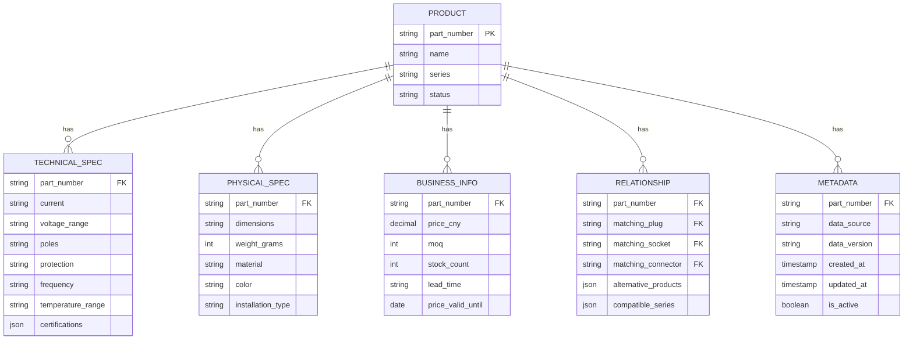

# SCAME 产品数据架构

## 概述

SCAME产品数据架构是基于wiki知识图谱的标准化数据模型，确保选型工具的准确性、一致性和可扩展性。本架构定义了产品数据的采集、处理、存储和应用的全流程。

## 📊 数据源分析

### 1. 主要数据源

| 数据源 | 格式 | 数据量 | 更新频率 | 数据质量 | 用途 |
|--------|------|--------|----------|----------|------|
| **wiki知识图谱** | Obsidian Markdown | 4,585个实体 | 手动更新 | ⭐⭐⭐⭐⭐ | 核心产品数据库 |
| **产品选型表CSV** | CSV (22个文件) | 12,087个产品 | 季度更新 | ⭐⭐⭐⭐⭐ | 技术参数和价格 |
| **官方PDF手册** | PDF (中英文) | 2个完整目录 | 年度更新 | ⭐⭐⭐⭐⭐ | 权威技术参考 |
| **培训资料PPT** | PPT (10个文件) | 技术文档 | 不定期 | ⭐⭐⭐⭐ | 应用场景和选型指南 |
| **价格表Excel** | Excel (2025版) | 价格和库存 | 月度更新 | ⭐⭐⭐⭐ | 商业信息 |

### 2. 数据源关联关系
```
wiki实体 (Markdown) ←→ CSV产品表 (技术参数)
       ↓                      ↓
官方PDF手册 (权威参考)  价格表Excel (商业信息)
       ↓                      ↓
培训资料PPT (应用场景) ←→ RAG知识库 (智能检索)
```

## 🏗️ 数据模型设计

### 核心实体关系图


### 1. 产品主模型 (Product)

#### 字段定义
```typescript
interface Product {
  // 标识字段
  partNumber: string;           // 唯一标识，如 "513.63532T"
  name: string;                // 产品名称，如 "OPTIMA-TOP 明装插座"
  series: string;              // 产品系列，如 "OPTIMA-TOP"
  category: ProductCategory;   // 产品类别，如 "明装插座"
  status: ProductStatus;       // 产品状态，如 "active", "discontinued"
  
  // 技术规格 (关联实体)
  technicalSpecs: TechnicalSpecs;
  physicalSpecs: PhysicalSpecs;
  businessInfo: BusinessInfo;
  relationships: Relationships;
  metadata: Metadata;
}
```

#### 产品状态枚举
```typescript
enum ProductStatus {
  ACTIVE = 'active',           // 正常销售
  DISCONTINUED = 'discontinued', // 已停产
  NEW = 'new',                // 新产品
  PROMOTIONAL = 'promotional', // 促销产品
  LIMITED = 'limited'         // 限量供应
}
```

### 2. 技术规格模型 (TechnicalSpecs)

#### 完整字段定义
```typescript
interface TechnicalSpecs {
  // 电气参数
  current: CurrentRating;      // 电流额定值，如 "63A"
  voltage: VoltageRange;       // 电压范围，如 ">50-250V"
  poles: PolesConfiguration;   // 极数配置，如 "2P+E"
  protection: ProtectionRating; // 防护等级，如 "IP44/IP54"
  
  // 频率和温度
  frequency?: FrequencyRange;  // 频率范围，如 "50/60 Hz"
  temperature?: TemperatureRange; // 工作温度，如 "-25°C to +40°C"
  
  // 认证和标准
  certifications: Certification[]; // 认证列表，如 ["CE", "UL", "CCC"]
  standards: Standard[];       // 符合标准，如 ["IEC 60309", "GB/T 11918"]
  
  // 特殊特性
  features: ProductFeature[];  // 产品特性，如 ["防盐雾", "透明手柄"]
  options: ProductOption[];    // 可选配置，如 ["带保险丝槽", "DIN导轨安装"]
}
```

#### 技术参数类型定义
```typescript
// 电流类型
type CurrentRating = 
  | '16A' | '20A' | '30A' | '32A' | '60A' | '63A' 
  | '100A' | '125A' | '160A' | '250A' | '320A' 
  | '370A' | '420A' | '500A' | '570A' | '800A';

// 电压范围类型
type VoltageRange = 
  | '24V' | '40-50V' | '100-130V' | '200-250V' 
  | '208-250V' | '277V' | '346-415V' | '380-415V'
  | '440-460V' | '480-500V' | '600-690V' | '1000V'
  | '3Ø250' | '3Ø380-415' | '3Ø480' | '3Ø600'
  | '3ØY120/208' | '3ØY277/480' | '3ØY347/600';

// 极数配置类型
type PolesConfiguration = 
  | '2P+E'     // 单相带接地
  | '3P+E'     // 三相带接地
  | '3P+N+E'   // 三相四线带接地
  | '4P+E'     // 四相带接地
  | '4P+N+E';  // 四相五线带接地

// 防护等级类型
type ProtectionRating = 
  | 'IP20' | 'IP44' | 'IP54' | 'IP66' 
  | 'IP67' | 'IP68' | 'IP69' | 'IP44/IP54'
  | 'IP66/IP67' | 'IP66/IP67/IP69';
```

### 3. 物理规格模型 (PhysicalSpecs)

```typescript
interface PhysicalSpecs {
  // 尺寸和重量
  dimensions: string;          // 安装尺寸，如 "106×240mm"
  weight?: string;             // 重量，如 "450g"
  
  // 材料和颜色
  material: MaterialType;      // 材料类型，如 "工程塑料"
  color?: string;              // 颜色，如 "黑色", "灰色"
  
  // 安装特性
  installationType: InstallationType; // 安装方式
  mountingHolePattern?: string;      // 安装孔位
  cableEntrySize?: string;           // 电缆入口尺寸
  
  // 环境适应性
  operatingTemperature: string;      // 工作温度范围
  storageTemperature?: string;       // 储存温度范围
  humidityResistance?: string;       // 防潮等级
}
```

### 4. 商业信息模型 (BusinessInfo)

```typescript
interface BusinessInfo {
  // 价格信息
  price: Money;                // 单价（人民币）
  currency: Currency;          // 货币，默认 "CNY"
  priceValidUntil?: Date;      // 价格有效期
  
  // 采购信息
  moq: number;                 // 最小起订量
  packageQuantity?: number;    // 包装数量
  leadTime: string;            // 交货周期，如 "7-14工作日"
  
  // 库存信息
  stockCount: number;          // 库存数量
  stockLocation?: string;      // 库存地点
  stockUpdatedAt?: Date;       // 库存更新时间
  
  // 供应商信息
  supplierCode?: string;       // 供应商代码
  manufacturer?: string;       // 制造商
  originCountry?: string;      // 原产国
}
```

### 5. 关系模型 (Relationships)

```typescript
interface Relationships {
  // 直接匹配关系
  matchingPlug?: string;       // 匹配插头型号
  matchingSocket?: string;     // 匹配插座型号
  matchingConnector?: string;  // 匹配连接器型号
  
  // 替代产品
  alternatives: AlternativeProduct[]; // 替代产品列表
  
  // 兼容系列
  compatibleSeries: string[];  // 兼容的产品系列
  
  // 应用场景
  applicationScenarios: ApplicationScenario[]; // 适用场景
  
  // 技术关联
  technicalReferences: TechnicalReference[]; // 技术参考
}
```

#### 替代产品定义
```typescript
interface AlternativeProduct {
  partNumber: string;          // 替代产品型号
  reason: AlternativeReason;   // 替代原因
  similarity: number;          // 相似度 (0-1)
  differences: string[];       // 差异说明
}

type AlternativeReason = 
  | 'upgrade'     // 升级替代
  | 'downgrade'   // 降级替代
  | 'equivalent'  // 等效替代
  | 'discontinued' // 停产替代
  | 'regional'    // 地区替代
  | 'cost'        // 成本优化替代
```

### 6. 元数据模型 (Metadata)

```typescript
interface Metadata {
  // 数据来源
  dataSource: DataSource;      // 数据来源
  sourceFile?: string;         // 源文件路径
  sourceVersion?: string;      // 源数据版本
  
  // 时间信息
  createdAt: Date;             // 创建时间
  updatedAt: Date;             // 更新时间
  importedAt?: Date;           // 导入时间
  
  // 质量控制
  dataQuality: DataQuality;    // 数据质量评级
  validationStatus: ValidationStatus; // 验证状态
  lastValidatedAt?: Date;      // 最后验证时间
  
  // 业务标记
  tags: string[];              // 标签
  notes?: string;              // 备注
  priority: number;            // 处理优先级
}
```

## 🔄 数据流转流程

### 1. 数据采集阶段
```
原始数据 → 文件监控 → 格式识别 → 初步解析 → 原始存储
   ↓         ↓          ↓          ↓          ↓
wiki更新   定时扫描   格式检测   内容提取   原始数据库
CSV文件    变更检测   编码识别   字段映射   备份存储
PDF手册   手动触发   质量检查   数据清洗   版本控制
```

### 2. 数据处理阶段
```
原始数据 → 数据清洗 → 标准化 → 验证 → 增强 → 结构化存储
   ↓         ↓          ↓        ↓       ↓          ↓
提取文本   格式统一   单位转换  规则校验  关系建立  主数据库
字符编码   去重处理   术语统一  逻辑验证  标签添加  索引创建
特殊字符   错误纠正   分类映射  专家复核  场景关联  缓存预热
```

### 3. 数据应用阶段
```
主数据库 → 查询优化 → 缓存层 → API服务 → 前端应用
   ↓          ↓          ↓         ↓          ↓
产品数据   索引优化  热点缓存  RESTful   Web界面
关系数据   查询重写  预加载   GraphQL   移动端
历史数据   分页处理  失效策略  WebSocket 机器人
```

## 🗃️ 数据库设计

### PostgreSQL 表结构

#### 产品主表 (products)
```sql
CREATE TABLE products (
  -- 主键和标识
  id UUID PRIMARY KEY DEFAULT gen_random_uuid(),
  part_number VARCHAR(50) UNIQUE NOT NULL,
  name VARCHAR(200) NOT NULL,
  series VARCHAR(50) NOT NULL,
  category VARCHAR(50) NOT NULL,
  status VARCHAR(20) DEFAULT 'active',
  
  -- 创建时间索引
  created_at TIMESTAMP DEFAULT CURRENT_TIMESTAMP,
  updated_at TIMESTAMP DEFAULT CURRENT_TIMESTAMP,
  
  -- 约束和索引
  CONSTRAINT chk_status CHECK (status IN ('active', 'discontinued', 'new', 'promotional', 'limited')),
  CONSTRAINT chk_part_number CHECK (part_number ~ '^(\d{3}\.\d{4,6}|899\.[A-Z]{2}\d{1}[A-Z]{2}\d{3})$')
);

-- 创建复合索引
CREATE INDEX idx_products_series_status ON products(series, status);
CREATE INDEX idx_products_category ON products(category);
CREATE INDEX idx_products_part_number_prefix ON products(LEFT(part_number, 3));
```

#### 技术规格表 (technical_specs)
```sql
CREATE TABLE technical_specs (
  id UUID PRIMARY KEY DEFAULT gen_random_uuid(),
  product_id UUID NOT NULL REFERENCES products(id) ON DELETE CASCADE,
  
  -- 电气参数
  current VARCHAR(20) NOT NULL,
  voltage_range VARCHAR(100) NOT NULL,
  poles VARCHAR(20) NOT NULL,
  protection VARCHAR(50) NOT NULL,
  
  -- 频率和温度
  frequency VARCHAR(20),
  temperature_range VARCHAR(50),
  
  -- 认证和标准 (JSON存储)
  certifications JSONB DEFAULT '[]',
  standards JSONB DEFAULT '[]',
  
  -- 特性和选项
  features JSONB DEFAULT '[]',
  options JSONB DEFAULT '[]',
  
  -- 元数据
  created_at TIMESTAMP DEFAULT CURRENT_TIMESTAMP,
  updated_at TIMESTAMP DEFAULT CURRENT_TIMESTAMP,
  
  -- 约束
  CONSTRAINT chk_current CHECK (current IN (
    '16A', '20A', '30A', '32A', '60A', '63A', '100A', '125A',
    '160A', '250A', '320A', '370A', '420A', '500A', '570A', '800A'
  )),
  
  -- 索引
  UNIQUE(product_id)
);

-- 查询优化索引
CREATE INDEX idx_tech_current ON technical_specs(current);
CREATE INDEX idx_tech_voltage ON technical_specs(voltage_range);
CREATE INDEX idx_tech_poles ON technical_specs(poles);
CREATE INDEX idx_tech_protection ON technical_specs(protection);
```

#### 物理规格表 (physical_specs)
```sql
CREATE TABLE physical_specs (
  id UUID PRIMARY KEY DEFAULT gen_random_uuid(),
  product_id UUID NOT NULL REFERENCES products(id) ON DELETE CASCADE,
  
  -- 尺寸和重量
  dimensions VARCHAR(100),
  weight_grams INTEGER,
  
  -- 材料和颜色
  material VARCHAR(50) NOT NULL,
  color VARCHAR(30),
  
  -- 安装特性
  installation_type VARCHAR(50) NOT NULL,
  mounting_hole_pattern VARCHAR(100),
  cable_entry_size VARCHAR(50),
  
  -- 环境适应性
  operating_temperature VARCHAR(50),
  storage_temperature VARCHAR(50),
  humidity_resistance VARCHAR(50),
  
  -- 元数据
  created_at TIMESTAMP DEFAULT CURRENT_TIMESTAMP,
  updated_at TIMESTAMP DEFAULT CURRENT_TIMESTAMP,
  
  UNIQUE(product_id)
);
```

#### 商业信息表 (business_info)
```sql
CREATE TABLE business_info (
  id UUID PRIMARY KEY DEFAULT gen_random_uuid(),
  product_id UUID NOT NULL REFERENCES products(id) ON DELETE CASCADE,
  
  -- 价格信息
  price_cny DECIMAL(10,2) NOT NULL,
  currency VARCHAR(3) DEFAULT 'CNY',
  price_valid_until DATE,
  
  -- 采购信息
  moq INTEGER DEFAULT 1,
  package_quantity INTEGER,
  lead_time VARCHAR(50),
  
  -- 库存信息
  stock_count INTEGER DEFAULT 0,
  stock_location VARCHAR(100),
  stock_updated_at TIMESTAMP,
  
  -- 供应商信息
  supplier_code VARCHAR(50),
  manufacturer VARCHAR(100),
  origin_country VARCHAR(50),
  
  -- 元数据
  created_at TIMESTAMP DEFAULT CURRENT_TIMESTAMP,
  updated_at TIMESTAMP DEFAULT CURRENT_TIMESTAMP,
  
  -- 约束
  CONSTRAINT chk_price CHECK (price_cny > 0),
  CONSTRAINT chk_moq CHECK (moq > 0),
  CONSTRAINT chk_stock CHECK (stock_count >= 0),
  
  UNIQUE(product_id)
);

-- 价格查询索引
CREATE INDEX idx_business_price ON business_info(price_cny);
CREATE INDEX idx_business_moq ON business_info(moq);
CREATE INDEX idx_business_stock ON business_info(stock_count);
```

#### 关系表 (product_relationships)
```sql
CREATE TABLE product_relationships (
  id UUID PRIMARY KEY DEFAULT gen_random_uuid(),
  product_id UUID NOT NULL REFERENCES products(id) ON DELETE CASCADE,
  
  -- 直接匹配关系
  matching_plug VARCHAR(50) REFERENCES products(part_number),
  matching_socket VARCHAR(50) REFERENCES products(part_number),
  matching_connector VARCHAR(50) REFERENCES products(part_number),
  
  -- 替代产品 (JSON存储)
  alternatives JSONB DEFAULT '[]',
  
  -- 兼容系列 (JSON存储)
  compatible_series JSONB DEFAULT '[]',
  
  -- 应用场景 (JSON存储)
  application_scenarios JSONB DEFAULT '[]',
  
  -- 技术参考 (JSON存储)
  technical_references JSONB DEFAULT '[]',
  
  -- 元数据
  created_at TIMESTAMP DEFAULT CURRENT_TIMESTAMP,
  updated_at TIMESTAMP DEFAULT CURRENT_TIMESTAMP,
  
  UNIQUE(product_id)
);

-- 关系查询索引
CREATE INDEX idx_relationships_matching ON product_relationships(
  COALESCE(matching_plug, ''),
  COALESCE(matching_socket, ''),
  COALESCE(matching_connector, '')
);
```

### 数据视图 (Views)

#### 产品完整信息视图
```sql
CREATE VIEW product_full_view AS
SELECT 
  p.id,
  p.part_number,
  p.name,
  p.series,
  p.category,
  p.status,
  
  -- 技术规格
  ts.current,
  ts.voltage_range,
  ts.poles,
  ts.protection,
  ts.frequency,
  ts.temperature_range,
  ts.certifications,
  ts.standards,
  ts.features,
  ts.options,
  
  -- 物理规格
  ps.dimensions,
  ps.weight_grams,
  ps.material,
  ps.color,
  ps.installation_type,
  ps.mounting_hole_pattern,
  ps.cable_entry_size,
  ps.operating_temperature,
  ps.storage_temperature,
  ps.humidity_resistance,
  
  -- 商业信息
  bi.price_cny,
  bi.currency,
  bi.price_valid_until,
  bi.moq,
  bi.package_quantity,
  bi.lead_time,
  bi.stock_count,
  bi.stock_location,
  bi.stock_updated_at,
  bi.supplier_code,
  bi.manufacturer,
  bi.origin_country,
  
  -- 关系信息
  pr.matching_plug,
  pr.matching_socket,
  pr.matching_connector,
  pr.alternatives,
  pr.compatible_series,
  pr.application_scenarios,
  pr.technical_references,
  
  -- 元数据
  p.created_at,
  p.updated_at
  
FROM products p
LEFT JOIN technical_specs ts ON p.id = ts.product_id
LEFT JOIN physical_specs ps ON p.id = ps.product_id
LEFT JOIN business_info bi ON p.id = bi.product_id
LEFT JOIN product_relationships pr ON p.id = pr.product_id
WHERE p.status = 'active';
```

#### 快速选型视图
```sql
CREATE VIEW selection_quick_view AS
SELECT 
  p.part_number,
  p.name,
  p.series,
  p.category,
  
  ts.current,
  ts.voltage_range,
  ts.poles,
  ts.protection,
  
  bi.price_cny,
  bi.moq,
  bi.stock_count,
  
  pr.matching_plug,
  pr.matching_socket,
  pr.matching_connector
  
FROM products p
JOIN technical_specs ts ON p.id = ts.product_id
JOIN business_info bi ON p.id = bi.product_id
JOIN product_relationships pr ON p.id = pr.product_id
WHERE p.status = 'active'
AND bi.stock_count > 0;
```

## 🔧 数据导入工具

### 1. Wiki知识图谱导入器
```python
class WikiImporter:
    def __init__(self, wiki_path: str):
        self.wiki_path = wiki_path
        
    def import_entities(self) -> List[Product]:
        """导入wiki实体目录下的所有产品"""
        entities_path = os.path.join(self.wiki_path, "entities")
        products = []
        
        for file_name in os.listdir(entities_path):
            if file_name.endswith(".md"):
                file_path = os.path.join(entities_path, file_name)
                product = self.parse_markdown_file(file_path)
                if product:
                    products.append(product)
        
        return products
    
    def parse_markdown_file(self, file_path: str) -> Optional[Product]:
        """解析单个Markdown文件"""
        with open(file_path, 'r', encoding='utf-8') as f:
            content = f.read()
        
        # 解析YAML frontmatter
        frontmatter = self.extract_frontmatter(content)
        if not frontmatter:
            return None
        
        # 解析表格内容
        tables = self.extract_tables(content)
        
        # 构建产品对象
        product = Product(
            part_number=frontmatter.get('title', ''),
            name=frontmatter.get('aliases', [''])[0],
            series=self.extract_series(frontmatter.get('tags', [])),
            # ... 其他字段解析
        )
        
        return product
```

### 2. CSV产品表导入器
```python
class CSVImporter:
    def __init__(self, csv_directory: str):
        self.csv_directory = csv_directory
        
    def import_all_csvs(self) -> Dict[str, List[Product]]:
        """导入所有CSV文件"""
        results = {}
        
        for csv_file in glob.glob(os.path.join(self.csv_directory, "*.csv")):
            file_name = os.path.basename(csv_file)
            products = self.import_csv_file(csv_file)
            results[file_name] = products
        
        return results
    
    def import_csv_file(self, csv_path: str) -> List[Product]:
        """导入单个CSV文件"""
        products = []
        
        with open(csv_path, 'r', encoding='utf-8') as f:
            reader = csv.DictReader(f)
            
            for row in reader:
                product = self.parse_csv_row(row, csv_path)
                if product:
                    products.append(product)
        
        return products
    
    def parse_csv_row(self, row: Dict, source_file: str) -> Optional[Product]:
        """解析CSV单行数据"""
        try:
            product = Product(
                part_number=row.get('订货号', '').strip(),
                name=row.get('产品类型', '') + ' ' + row.get('产品系列', ''),
                series=row.get('产品系列', ''),
                # ... 其他字段解析
            )
            
            # 添加数据源信息
            product.metadata.data_source = f"csv:{os.path.basename(source_file)}"
            product.metadata.imported_at = datetime.now()
            
            return product
            
        except Exception as e:
            logger.error(f"解析CSV行失败: {row}, 错误: {e}")
            return None
```

### 3. 数据合并和去重
```python
class DataMerger:
    def __init__(self):
        self.products_by_part_number = {}
        
    def merge_sources(self, *sources: List[Product]) -> List[Product]:
        """合并多个数据源的产品数据"""
        for source in sources:
            for product in source:
                self.merge_product(product)
        
        return list(self.products_by_part_number.values())
    
    def merge_product(self, new_product: Product):
        """合并单个产品数据"""
        part_number = new_product.part_number
        
        if part_number not in self.products_by_part_number:
            # 新产品，直接添加
            self.products_by_part_number[part_number] = new_product
        else:
            # 已有产品，合并数据
            existing = self.products_by_part_number[part_number]
            merged = self.merge_product_data(existing, new_product)
            self.products_by_part_number[part_number] = merged
    
    def merge_product_data(self, existing: Product, new: Product) -> Product:
        """合并两个产品数据源"""
        # 优先级规则：CSV > Wiki > PDF
        source_priority = {
            'csv': 3,
            'wiki': 2, 
            'pdf': 1
        }
        
        # 根据数据源优先级选择字段值
        merged = existing.copy()
        
        # 合并技术规格
        if self.get_source_priority(new.metadata.data_source) > \
           self.get_source_priority(existing.metadata.data_source):
            merged.technical_specs = new.technical_specs
        
        # 合并商业信息（价格等需要最新数据）
        if 'csv' in new.metadata.data_source:
            merged.business_info = new.business_info
        
        # 更新元数据
        merged.metadata.updated_at = datetime.now()
        merged.metadata.data_sources = list(set(
            existing.metadata.data_sources + [new.metadata.data_source]
        ))
        
        return merged
```

## 🧪 数据质量保证

### 1. 数据验证规则
```typescript
interface ValidationRule {
  id: string;
  field: string;
  type: 'format' | 'range' | 'reference' | 'logic';
  condition: any;
  errorMessage: string;
  severity: 'error' | 'warning';
}

const validationRules: ValidationRule[] = [
  {
    id: 'part_number_format',
    field: 'partNumber',
    type: 'format',
    condition: /^(\d{3}\.\d{4,6}|899\.[A-Z]{2}\d{1}[A-Z]{2}\d{3})$/,
    errorMessage: '订货号格式不正确',
    severity: 'error'
  },
  {
    id: 'current_rating',
    field: 'technicalSpecs.current',
    type: 'range',
    condition: ['16A', '32A', '63A', '125A', '160A', '250A'],
    errorMessage: '无效的电流额定值',
    severity: 'error'
  },
  {
    id: 'price_positive',
    field: 'businessInfo.price',
    type: 'range',
    condition: { min: 0 },
    errorMessage: '价格必须为正数',
    severity: 'error'
  },
  {
    id: 'matching_compatibility',
    field: 'relationships.matchingPlug',
    type: 'reference',
    condition: 'exists_in_products',
    errorMessage: '匹配插头型号不存在',
    severity: 'warning'
  }
];
```

### 2. 数据质量报告
```typescript
interface DataQualityReport {
  timestamp: Date;
  totalProducts: number;
  validatedProducts: number;
  
  // 按类别统计
  byCategory: {
    [category: string]: {
      total: number;
      valid: number;
      warnings: number;
      errors: number;
    }
  };
  
  // 常见问题
  commonIssues: Array<{
    ruleId: string;
    count: number;
    examples: string[];
  }>;
  
  // 数据完整性
  completeness: {
    technicalSpecs: number;  // 技术规格完整度
    businessInfo: number;    // 商业信息完整度
    relationships: number;   // 关系信息完整度
    overall: number;         // 总体完整度
  };
  
  // 建议
  recommendations: string[];
}
```

## 🔄 数据更新策略

### 1. 增量更新
```typescript
class IncrementalUpdater {
  async updateProducts(): Promise<UpdateResult> {
    // 1. 检测数据源变更
    const changes = await this.detectChanges();
    
    // 2. 下载最新数据
    const newData = await this.fetchLatestData(changes);
    
    // 3. 数据验证
    const validationResult = await this.validateData(newData);
    
    if (!validationResult.valid) {
      throw new Error(`数据验证失败: ${validationResult.errors.join(', ')}`);
    }
    
    // 4. 应用更新
    const updateResult = await this.applyUpdates(newData);
    
    // 5. 更新缓存和索引
    await this.updateCacheAndIndexes(updateResult.updatedProducts);
    
    return updateResult;
  }
  
  private async detectChanges(): Promise<DataSourceChange[]> {
    // 检查文件修改时间、大小等
    // 对比数据库中的版本信息
    // 返回变更的数据源列表
  }
}
```

### 2. 版本控制
```typescript
interface DataVersion {
  version: string;            // 版本号，如 "2026.04.14.001"
  timestamp: Date;            // 发布时间
  changes: VersionChange[];   // 变更内容
  source: string;             // 数据来源
  checksum: string;           // 数据校验和
}

interface VersionChange {
  type: 'added' | 'modified' | 'deleted';
  partNumber: string;
  changes: Record<string, any>;
}
```

## 📈 性能优化

### 1. 数据库优化
- 分区表设计（按产品系列分区）
- 查询缓存（Redis）
- 只读副本（用于报表查询）
- 连接池优化

### 2. 缓存策略
```typescript
const cacheConfig = {
  // 产品详情缓存
  productDetails: {
    ttl: 3600,  // 1小时
    maxSize: 10000,
    strategy: 'lru'
  },
  
  // 选型结果缓存
  selectionResults: {
    ttl: 1800,  // 30分钟
    maxSize: 5000,
    strategy: 'lru'
  },
  
  // 编码规则缓存
  codingRules: {
    ttl: 86400, // 24小时
    maxSize: 100,
    strategy: 'fifo'
  }
};
```

### 3. 索引优化
- 复合索引设计
- 部分索引（针对活跃产品）
- 全文搜索索引
- 空间索引（用于尺寸查询）

---

**文档版本**: 1.0  
**更新日期**: 2026-04-14  
**维护者**: 数据架构团队  
**重要性**: ⭐⭐⭐⭐⭐ (数据是系统的核心资产)